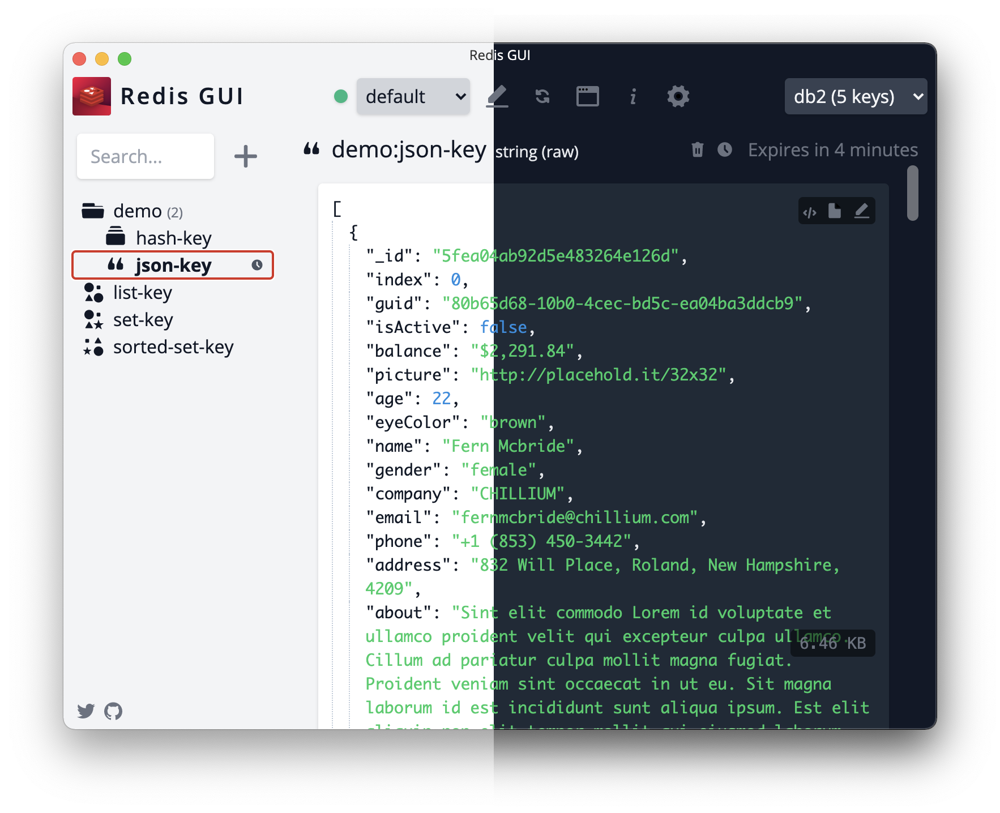

# Redis GUI (unofficial)

A graphical UI for managing Redis databases.

## Main features

* SSH tunneling
* Namespacing support
* JSON viewer
* Console with command args and summary
* Light and dark mode
* TTL management

## Download

Binaries are available to download on [releases page](https://github.com/ekvedaras/redis-gui/releases/latest).

## Screenshots

